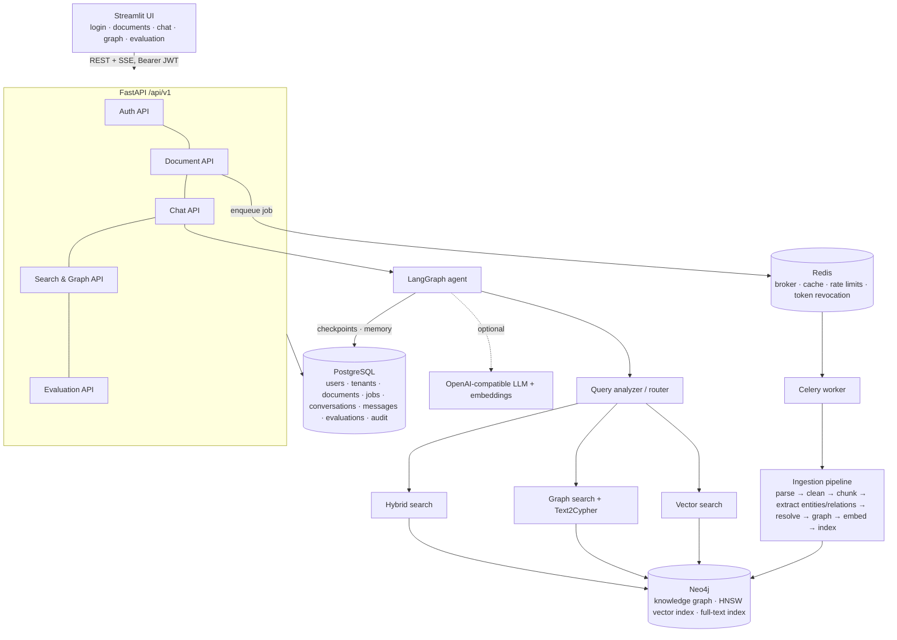
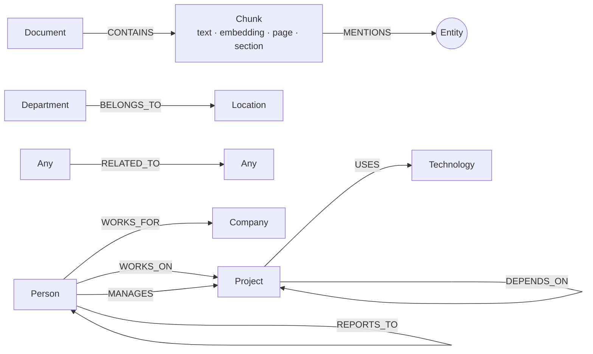
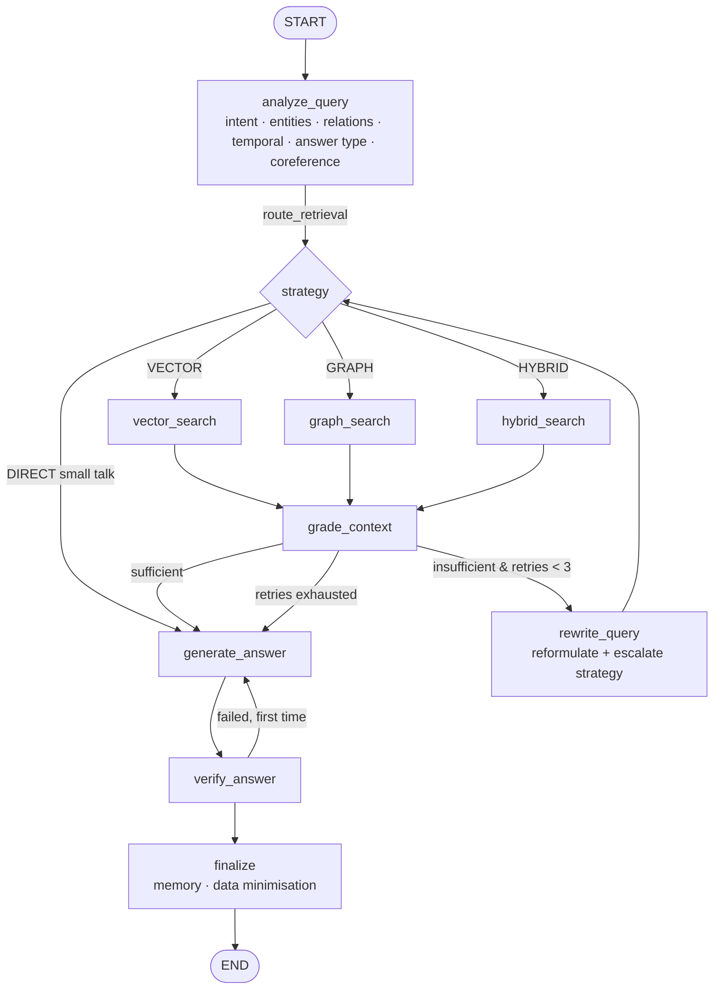

# Agentic GraphRAG — Intelligent Knowledge Graph Assistant

An enterprise knowledge assistant that turns PDF/DOCX/TXT/Markdown documents into a **Neo4j knowledge graph + vector index**, and answers questions with a **LangGraph agent** that decides — per question — whether to use vector search, graph traversal or hybrid retrieval, grades its evidence, rewrites the query when evidence is weak (max 3 retries), and verifies that the final answer is grounded and cited.

It is not a "PDF chatbot": the agent never sends a question straight to an LLM. Every answer goes through

```
Question → Analyze → Identify & link entities → Choose strategy → Retrieve → Grade evidence
        → (insufficient? rewrite + retrieve again, ≤3×) → Generate grounded answer → Verify → Answer + citations
```

and abstains with *"I don't have enough information in the uploaded knowledge base to answer this reliably."* when the knowledge base does not support an answer.

| | |
|---|---|
| **Backend** | Python 3.11, FastAPI, Pydantic v2, SQLAlchemy 2 + Alembic, Celery |
| **GenAI** | LangGraph (agent + Postgres checkpointing), LangChain, OpenAI-compatible LLM & embeddings |
| **Data** | Neo4j 5 (knowledge graph, HNSW vector index, full-text index), PostgreSQL 16, Redis 7 |
| **Frontend** | Streamlit (no React) talking only to the FastAPI API |
| **Ops** | Docker Compose with health checks, structured JSON logs, request ids |

---

## Contents

1. [Quick start](#quick-start) · 2. [Architecture](#architecture) · 3. [System design](#system-design) · 4. [Features](#features)
5. [Folder structure](#folder-structure) · 6. [Installation](#installation) · 7. [Environment variables](#environment-variables)
8. [Docker setup](#docker-setup) · 9. [PostgreSQL / Neo4j / Redis setup](#postgresql-setup) · 10. [API](#api-documentation)
11. [Graph schema](#graph-schema) · 12. [GraphRAG, vector & hybrid search](#graphrag-explanation) · 13. [Agent workflow / LangGraph](#agent-workflow)
14. [Streamlit](#streamlit-explanation) · 15. [Evaluation](#evaluation) · 16. [Testing](#testing) · 17. [Security](#security)
18. [Scaling](#scaling) · 19. [Deployment](#deployment) · 20. [Known limitations](#known-limitations) · 21. [Future improvements](#future-improvements)

---

## Quick start

```bash
cp .env.example .env            # optionally set OPENAI_API_KEY; change the passwords and JWT secret
docker compose up --build       # backend, celery-worker, frontend, postgres, neo4j, redis
make seed                       # optional: demo user demo@techcorp.com / DemoPassw0rd + sample documents
```

| Service | URL |
|---|---|
| Streamlit UI | http://localhost:8501 |
| API + Swagger | http://localhost:8000/docs (ReDoc: `/redoc`) |
| Neo4j Browser | http://localhost:7474 |

**No API key? It still works.** With `OPENAI_API_KEY` empty, `LLM_PROVIDER=auto` selects a deterministic offline
provider: rule-based entity/relationship extraction, graph-grounded routing, extractive answer generation and
feature-hashing embeddings. Every component — ingestion, graph, vector index, agent, verification, evaluation — runs
for real; set a key (or any OpenAI-compatible `OPENAI_BASE_URL`, e.g. vLLM/Ollama/Azure gateway) to switch the
reasoning steps to the LLM.

Behind a TLS-intercepting corporate proxy, pass its CA to the image build (mounted only during `pip install`, never
stored in a layer): `BUILD_CA_FILE=/path/to/ca.pem docker compose build`.

---

## Architecture



## System design

* **API layer (FastAPI)** — thin routers; business logic lives in `services/`. Consistent error envelope, request-id
  middleware, security headers, CORS, rate limiting, dependency-injected auth/tenant context.
* **Composition root** (`core/container.py`) — builds the graph reader, embedder, LLM client, retrievers, reranker,
  tools and the compiled LangGraph agent once per process. Tests inject an in-memory graph store through the same seam.
* **Asynchronous ingestion** — uploads return `202 Accepted` immediately; Celery workers (separate queues for
  `ingestion` and `evaluation`, `acks_late`, idempotent tasks, retries with backoff for transient Neo4j/embedding
  failures) process documents and report stage-by-stage progress.
* **Storage split** — Neo4j holds everything retrieval needs (graph, chunks, embeddings, indexes). PostgreSQL holds
  transactional/system-of-record data and LangGraph checkpoints. Redis holds ephemeral state.
* **Tenant isolation everywhere** — every table row, graph node and relationship carries `tenant_id`; every query
  filters on it; cache keys and checkpoint thread ids embed it (details in [Security](#security)).

## Features

* JWT auth (access + **rotating refresh tokens with reuse detection**, logout revocation), Argon2 password hashing.
* Multi-tenancy: registering creates an isolated tenant; admins can add users to their tenant.
* Upload PDF (PyMuPDF), DOCX (python-docx, incl. tables), TXT, Markdown — with signature, size, zip-bomb and type checks.
* Section/page-aware, token-based chunking (default 800 tokens / 100 overlap), never crossing page boundaries.
* Entity + relationship extraction with **validated** structured LLM output (or deterministic offline extraction),
  whitelisted relationship types with domain/range constraints.
* Entity resolution (normalisation, aliases, exact, fuzzy/semantic, LLM tie-break) within documents and against the graph.
* Neo4j knowledge graph + HNSW vector index + BM25 full-text indexes.
* Vector, graph (multi-hop, bridge detection), hybrid (RRF fusion + metadata filters) retrieval, optional reranking.
* **Safe Text2Cypher**: validation, schema check, tenant-filter injection, read-only execution.
* LangGraph agent: analyze → route → retrieve → grade → rewrite (≤3) → generate → verify (→ regenerate once) → memory.
* Grounded answers with inline `[n]` citations, abstention when evidence is insufficient.
* Conversation memory ("that project" → *Project Alpha*) persisted with LangGraph's Postgres checkpointer.
* SSE streaming of agent progress, tokens, citations and verification.
* Streamlit UI: login/register, dashboard, documents with live pipeline progress, ChatGPT-style chat with agent trace,
  interactive knowledge graph explorer, evaluation dashboard, settings.
* Evaluation harness (38 questions, 6 categories) comparing Vector RAG vs GraphRAG vs Agentic GraphRAG.

## Folder structure

```
.
├── backend/
│   ├── app/
│   │   ├── main.py                 FastAPI app: middleware, error handlers, routers, lifespan
│   │   ├── core/                   config, logging (JSON + redaction), security (JWT/argon2), dependencies, errors, container
│   │   ├── api/                    auth, documents, chat (JSON + SSE), search & graph, evaluation, health
│   │   ├── models/                 SQLAlchemy models: tenant, user (+refresh tokens), document, job, conversation, message, evaluation, audit
│   │   ├── schemas/                Pydantic request/response models
│   │   ├── db/                     postgres (async + sync engines), neo4j drivers & schema, redis (tenant cache, rate limiter)
│   │   ├── ingestion/              loader, parser, chunker, metadata, entity/relationship extraction, entity resolver, embedding, pipeline
│   │   ├── graph/                  schema (whitelists), queries (Cypher), repository, builder, cypher_validator, text2cypher
│   │   ├── retrieval/              vector, graph, hybrid, reranker, retriever (facade + cache), query_parsing, types
│   │   ├── agents/                 state, workflow (LangGraph), router (query analyzer), nodes/, tools/
│   │   ├── llm/                    OpenAI-compatible client: structured output, streaming, timeouts, usage tracking
│   │   ├── services/               document, chat, search, evaluation, auth, audit
│   │   ├── workers/                celery_app, tasks (ingestion, evaluation)
│   │   ├── scripts/                generate_samples, seed_demo
│   │   └── utils/                  text, tokens, ids
│   ├── alembic/                    migrations
│   ├── data/samples/               sample enterprise corpus (PDF, DOCX, MD, TXT)
│   ├── data/evaluation/            questions.json (38 questions)
│   ├── tests/                      unit/, integration/, evaluation/, fakes (in-memory graph), openai_stub
│   ├── docker/entrypoint.sh        api | worker | migrate | seed
│   ├── requirements.txt
│   └── Dockerfile
├── frontend/
│   ├── app.py                      entry point: login/register, st.navigation
│   ├── pages/                      1_Dashboard, 2_Documents, 3_Chat, 4_Knowledge_Graph, 5_Evaluation, 6_Settings
│   ├── components/                 chat, citations, graph (pyvis), agent_status
│   ├── services/api_client.py      the only way the UI talks to the backend
│   ├── utils/session.py            session-state auth helpers
│   ├── requirements.txt
│   └── Dockerfile
├── neo4j/                          schema.cypher, seed.cypher
├── tests/e2e/                      system tests against the running docker stack
├── docker-compose.yml
├── .env.example
├── Makefile
└── README.md
```

## Installation

**Docker (recommended):** see [Quick start](#quick-start).

**Local development** (Python 3.11+):

```bash
docker compose up -d postgres neo4j redis      # or run them yourself; expose ports as needed
cd backend
python -m venv .venv && . .venv/bin/activate
pip install -r requirements.txt
export POSTGRES_HOST=localhost NEO4J_URI=bolt://localhost:7687 REDIS_URL=redis://localhost:6379/0 UPLOAD_DIR=/tmp/uploads
alembic upgrade head
uvicorn app.main:app --reload --port 8000
celery -A app.workers.celery_app worker -Q ingestion,evaluation,default --loglevel=INFO

cd ../frontend && pip install -r requirements.txt && API_BASE_URL=http://localhost:8000/api/v1 streamlit run app.py
```

> The compose file publishes only the backend (8000), frontend (8501) and Neo4j (7474/7687) ports. For local
> development against compose-managed Postgres/Redis, add `ports:` entries in a `docker-compose.override.yml`.

## Environment variables

All configuration is environment-based (`backend/app/core/config.py`); secrets are never logged or returned by the API.

| Variable | Default | Purpose |
|---|---|---|
| `OPENAI_API_KEY` | – | Enables the OpenAI-compatible provider (`LLM_PROVIDER=auto`) |
| `OPENAI_BASE_URL` | – | Any OpenAI-compatible endpoint (vLLM, Ollama, Azure gateway, …) |
| `LLM_PROVIDER` / `EMBEDDING_PROVIDER` | `auto` | `openai` \| `heuristic` / `openai` \| `hashing` |
| `LLM_MODEL` / `EMBEDDING_MODEL` | `gpt-4o-mini` / `text-embedding-3-small` | Models |
| `EMBEDDING_DIMENSIONS` | `1536` | Must match the embedding model (vector index dimension) |
| `POSTGRES_HOST/PORT/DB/USER/PASSWORD` | | PostgreSQL |
| `NEO4J_URI/USERNAME/PASSWORD` | | Neo4j |
| `REDIS_URL` | `redis://redis:6379/0` | Broker, cache, rate limits |
| `JWT_SECRET_KEY` | – | ≥32 chars, enforced in `ENVIRONMENT=production` |
| `JWT_ACCESS_TOKEN_EXPIRE_MINUTES` / `JWT_REFRESH_TOKEN_EXPIRE_DAYS` | `30` / `7` | Token lifetimes |
| `MAX_UPLOAD_SIZE_MB` | `25` | Upload limit (streamed, aborts early) |
| `RATE_LIMIT_AUTH` / `RATE_LIMIT_CHAT` / `RATE_LIMIT_UPLOAD` | `10/minute` / `30/minute` / `10/hour` | `<n>/<second\|minute\|hour\|day>` |
| `CHUNK_SIZE` / `CHUNK_OVERLAP` | `800` / `100` | Tokens |
| `TOP_K` / `RETRIEVAL_THRESHOLD` | `8` / `0.55` | Retrieval depth / evidence-grade threshold |
| `RERANKER` | `score` | `none` \| `score` \| `cross_encoder` (optional `sentence-transformers`) |
| `AGENT_MAX_RETRIES` | `3` | Query-rewrite budget |
| `CORS_ORIGINS` | `http://localhost:8501` | Comma-separated; wildcards rejected in production |

Switching embedding providers changes vector dimensions; re-create the Neo4j vector index (or use a fresh volume)
and re-ingest when you do.

## Docker setup

`docker compose up --build` starts six services with health checks and ordered startup:

| Service | Image | Health check | Depends on |
|---|---|---|---|
| `postgres` | postgres:16-alpine | `pg_isready` | – |
| `neo4j` | neo4j:5.26-community | HTTP 7474 | – |
| `redis` | redis:7-alpine (AOF on) | `redis-cli ping` | – |
| `backend` | ./backend (runs `alembic upgrade head`, then uvicorn) | `/api/v1/health/ready` (checks all 3 stores) | postgres, neo4j, redis healthy |
| `celery-worker` | ./backend (`worker` role) | `celery inspect ping` | backend healthy |
| `frontend` | ./frontend (Streamlit) | `/_stcore/health` | backend healthy |

Uploads are stored on a named volume shared by `backend` and `celery-worker`. Containers run as a non-root user.

## PostgreSQL setup

Schema is managed by Alembic (`backend/alembic/versions/0001_initial_schema.py`) and applied automatically when the
backend starts (`alembic upgrade head`; also `make migrate`). Tables: `tenants`, `users`, `refresh_tokens`,
`documents`, `ingestion_jobs`, `conversations`, `messages`, `evaluation_runs`, `evaluation_results`, `audit_logs`, plus
LangGraph's checkpoint tables (created by `AsyncPostgresSaver.setup()`). All tenant-owned tables index `tenant_id`;
`documents` has a `(tenant_id, checksum)` unique constraint for de-duplication.

## Neo4j setup

Constraints and indexes are created idempotently at backend start-up and by every worker (`neo4j/schema.cypher`
documents the same DDL): unique ids for `Entity`/`Chunk`/`Document`, composite `(tenant_id, …)` indexes, the
`chunk_embedding_index` HNSW vector index (cosine) and full-text indexes over chunk text and entity names/aliases.
`neo4j/seed.cypher` loads the sample entity graph for a given tenant without APOC; `make seed` is the recommended path
because it runs the real pipeline (so chunks, embeddings and citations exist too).

## Redis setup

Redis is the Celery broker/result backend and stores: tenant-namespaced retrieval cache
(`tenant:{tenant_id}:v{version}:query:{namespace}:{hash}`, invalidated by bumping a per-tenant version after
ingestion/deletion), sliding-window rate limits (`ratelimit:{scope}:{identity}`) and revoked access-token ids
(`revoked:access:{jti}`, expiring with the token). Cache and rate-limit failures degrade gracefully (configurable
fail-open) instead of failing requests.

## API documentation

Interactive docs at **`/docs`** (Swagger, with descriptions and examples) and `/redoc`. Base path `/api/v1`.

| Method | Path | Description |
|---|---|---|
| POST | `/auth/register` · `/auth/login` · `/auth/refresh` · `/auth/logout` | JWT auth (rotating refresh tokens) |
| GET / POST | `/auth/me` · `/auth/users` | Current user & tenant · admin creates a user in their tenant |
| POST | `/documents/upload` | Upload (202) → Celery ingestion job |
| GET | `/documents` · `/documents/{id}` · `/documents/{id}/status` · `/documents/stats` | List, metadata, stage-by-stage progress, counts |
| POST / DELETE | `/documents/{id}/reprocess` · `/documents/{id}` | Re-ingest · delete (prunes graph) |
| POST | `/chat` · `/chat/stream` | Agent answer (JSON) · Server-Sent Events |
| GET / DELETE | `/chat/conversations`, `/chat/conversations/{id}/messages`, `/chat/conversations/{id}` | History & memory |
| POST | `/search` | Direct VECTOR / GRAPH / HYBRID retrieval (no agent) |
| GET | `/graph/stats` · `/graph/entities` · `/graph/entities/{id}` · `/graph/subgraph` | Graph explorer |
| POST / GET | `/evaluation/run` · `/evaluation/results` · `/evaluation/dataset` | Benchmark |
| GET | `/health` · `/health/ready` · `/settings` | Probes · public (non-secret) config |

`POST /api/v1/chat` → `{"conversation_id": "...", "message": "Which projects use Kafka?"}` returns
`answer, sources[], retrieval_strategy, confidence` plus `graph_evidence, retrieved_chunks, trace, verification,
rewritten_query, retry_count, latency_ms, token_usage`.

`POST /api/v1/chat/stream` emits `agent_started, query_analyzed, retrieval_started, retrieval_completed, reasoning,
token, citation, verification, completed` (and `error`).

Errors always use one envelope (no stack traces): `{"success": false, "error": {"code": "DOCUMENT_NOT_FOUND",
"message": "Document not found"}, "request_id": "..."}`. Codes include `INVALID_FILE`, `UNSUPPORTED_FILE_TYPE`,
`FILE_TOO_LARGE`, `DOCUMENT_PROCESSING_FAILED`, `LLM_TIMEOUT`, `MALFORMED_LLM_OUTPUT`, `EMBEDDING_FAILED`,
`NEO4J_UNAVAILABLE`, `POSTGRES_UNAVAILABLE`, `REDIS_UNAVAILABLE`, `CYPHER_VALIDATION_FAILED`, `RETRIEVAL_FAILED`,
`AUTHENTICATION_FAILED`, `TOKEN_EXPIRED`, `TOKEN_REVOKED`, `RATE_LIMIT_EXCEEDED` (+ `Retry-After`), `VALIDATION_ERROR`.

## Graph schema



* Entity labels: `Person, Company, Project, Technology, Department, Product, Location, Concept` (+ `:Entity`).
* Relationship types are a closed whitelist (`WORKS_FOR, WORKS_ON, MANAGES, USES, BELONGS_TO, REPORTS_TO,
  DEPENDS_ON, RELATED_TO` + structural `CONTAINS, MENTIONS`) with source/target type constraints
  (`graph/schema.py`). Relationships keep `chunk_ids`, `document_ids` and an `evidence` sentence, so every graph fact
  can be cited back to its source page.
* Entity ids are deterministic (`hash(tenant, type, canonical name)`), which makes re-ingestion idempotent.

## GraphRAG explanation

Plain vector RAG retrieves passages that *look like* the question; it cannot follow relationships spread across
documents. GraphRAG extracts entities and relationships into a graph, so multi-hop questions become traversals:

> *Which developers work on Kafka projects managed by Rahul?*

1. **Link anchors** in the tenant graph: `Rahul (Person)`, `Kafka (Technology)` (exact/alias/fuzzy matching).
2. **Relation hints** from the question: `WORKS_ON` (developers), `MANAGES`.
3. **Bridges**: entities adjacent to *all* anchors through relation types compatible with each anchor
   → `Project Alpha` (`Rahul -MANAGES-> Project Alpha -USES-> Kafka`). `Project Gamma` uses Kafka but is managed by
   Priya, so it is excluded; Amit `REPORTS_TO` Rahul is not a valid bridge edge.
4. **Bounded, hint-guided expansion** (≤ `GRAPH_MAX_HOPS`) collects `Amit -WORKS_ON-> Project Alpha`, `Neha -WORKS_ON-> Project Alpha`.
5. **Answer candidates** of the expected type (`Person`, from "developers") attached to the bridges → **Amit, Neha**.
   When the question names an intermediate kind (*"technologies used by **projects** that Priya manages"*), the
   traversal goes anchor → intermediate type → answer type.

For questions the templates cannot express, **Text2Cypher** (LLM mode) generates Cypher that is validated, tenant-scoped
and executed read-only (see [Security](#security)).

## Vector search explanation

Chunks are embedded (`OpenAIEmbeddings`, batched, dimension-checked; or offline feature hashing) and stored as a
Neo4j vector property indexed by HNSW. `similarity_search(query, tenant_id, top_k)` returns chunk, score, document,
page, section and metadata. Tenant isolation never relies on post-filtering alone: small tenants use an **exact,
tenant-scoped k-NN scan** (`vector.similarity.cosine` over `(:Chunk {tenant_id})`); large tenants use the ANN index
with adaptive over-fetching and a mandatory `tenant_id` filter. Metadata filters (document ids, filenames, page range,
section) are applied in the same query.

## Hybrid search explanation

Hybrid = **vector + BM25 keyword + graph** + metadata filtering, run concurrently and fused with weighted
**Reciprocal Rank Fusion**. Graph knowledge enters the fusion as two extra ranked lists: chunks cited as evidence by
the top graph facts, and chunks that `MENTION` linked/bridge entities — so graph reasoning directly promotes the right
passages. Results are optionally reranked (`RERANKER=score`: retrieval score + query-term overlap + graph relevance +
metadata relevance; `cross_encoder` optional), and cached per tenant.

| Question | Strategy |
|---|---|
| What is Kafka? | VECTOR |
| Who manages Project Alpha? | GRAPH |
| Which developers work on Kafka projects managed by Rahul? | HYBRID |
| How is Redis used in Project Alpha? (explanation + relationship) | HYBRID |
| Tell me something not contained in the documents. | → insufficient-evidence answer |

## Agent workflow



**Query analyzer / router** (`agents/router.py`). Produces a validated `QueryAnalysis`. With an LLM it uses a
structured classifier — but it skips the call for trivially classifiable questions (small talk, plain definitions), and
the decision is always **grounded in the graph**: candidate entities are linked against Neo4j first, and a `GRAPH` route
with no linked entity is upgraded to `HYBRID`; `DIRECT` is only allowed for small talk.

**Tools** (`agents/tools/`): `vector_search_tool`, `graph_search_tool`, `hybrid_search_tool`, `document_search_tool`.
Each validates input (Pydantic args schema), takes the tenant **from the runnable config set by the server — never
from model-controlled arguments**, applies a timeout, returns structured `ToolOutput`, and logs execution.

**Evidence grading** combines entity coverage, coverage of the question's *information terms* (what is being asked
beyond entity names — e.g. "budget" in *"What is the budget of Project Beta?"*), retrieval scores and graph signals.
Clear passes/fails cost no LLM call; only the ambiguous band is sent to the LLM grader.

**Query rewriting** reformulates (canonical entity names, keywords) and escalates strategy
(e.g. VECTOR → HYBRID → GRAPH). Loops are bounded twice: `AGENT_MAX_RETRIES=3` in the routing function and LangGraph's
`recursion_limit`.

**Generation** sees only the question and numbered evidence (graph facts + passages + source metadata) and must cite
`[n]` for every claim, or emit an insufficient-evidence sentinel. **Verification** checks claim support against the cited
evidence, citation validity, relevance and confidence (LLM verifier + deterministic checks). On failure it regenerates
once with a stricter prompt, then falls back to the insufficient-evidence answer.

### LangGraph explanation

* `StateGraph(AgentState)` with nine nodes and conditional edges (`agents/workflow.py`).
* **Checkpointing**: `AsyncPostgresSaver` (pooled psycopg) with thread id `"{tenant_id}:{conversation_id}"`; runs use
  `durability="exit"` so only the final state of each turn is persisted, and `finalize` clears bulky evidence
  (chunks, facts) before it is saved — memory keeps recent turns and *focus entities* only.
* **Conversation memory**: focus entities (answer bridges, linked entities, answer candidates) let follow-ups such as
  *"What technologies does **that project** use?"* resolve to *Project Alpha*.
* **Streaming**: nodes publish progress with `get_stream_writer()`; the chat service consumes
  `astream(stream_mode=["updates", "custom"])` and forwards SSE events; LLM answers stream token by token.

## Streamlit explanation

The UI (`frontend/`) contains no business logic: every action goes through `services/api_client.py` (typed methods,
consistent `APIError`, transparent token refresh, SSE parsing). Tokens live only in server-side `st.session_state`
(never URLs or browser storage); `st.navigation` exposes protected pages only after login.

| Page | What it shows |
|---|---|
| Login / Register | Creates a tenant workspace or logs in |
| Dashboard | Total/processed/processing/failed documents, entities, relationships, chunks, conversations, charts, recent activity |
| Documents | Multi-file upload, live ingestion pipeline (Parsing → … → Completed), metadata, reprocess, delete |
| Chat | `st.chat_message`/`st.chat_input`, live agent status (`st.status`), streamed tokens, answer, expandable sources, graph evidence, retrieved chunks, strategy, confidence and an agent trace |
| Knowledge Graph | Interactive pyvis/vis.js graph (self-contained, sandboxed `data:` iframe), entity search, details, neighbours, relationships, source documents |
| Evaluation | Run benchmarks; accuracy, faithfulness, context relevance, recall, latency, tokens; per-system and per-category charts |
| Settings | Effective non-secret configuration and service health |

## Evaluation

`backend/data/evaluation/questions.json` — **38 questions** over the sample corpus in six categories: simple factual (6),
semantic (5), graph relationship (9), multi-hop (8), hybrid (5), unanswerable (5). Three systems are compared:

* **Vector RAG** — single-shot vector retrieval + grounded generation.
* **GraphRAG** — single-shot graph retrieval + grounded generation.
* **Agentic GraphRAG** — the full agent.

Metrics per question (stored in `evaluation_results`): correctness (expected-keyword recall; for unanswerable
questions, whether the system abstained), faithfulness (claim support), context relevance, retrieval recall, latency
and token usage; plus routing accuracy for the agent. Run from the UI, `POST /api/v1/evaluation/run`, or `make eval`.

Results from the Docker stack (offline heuristic provider, executed by the Celery worker):

| System | Accuracy | Faithfulness | Context relevance | Retrieval recall | Avg latency | Routing accuracy |
|---|---|---|---|---|---|---|
| Vector RAG | 0.706 | 1.00 | 0.454 | 1.00 | 22 ms | – |
| GraphRAG | 0.583 | 1.00 | 0.571 | 0.829 | 44 ms | – |
| **Agentic GraphRAG** | **1.000** | **1.00** | 0.562 | **1.00** | 69 ms | **1.00** |

| Category | Vector RAG | GraphRAG | Agentic |
|---|---|---|---|
| simple factual | 1.00 | 0.00 | 1.00 |
| semantic | 1.00 | 0.00 | 1.00 |
| graph relationship | 0.89 | 1.00 | 1.00 |
| multi-hop | 0.50 | 1.00 | 1.00 |
| hybrid | 0.57 | 0.63 | 1.00 |
| unanswerable | 0.20 | 0.40 | 1.00 |

**Read these numbers honestly**: the offline extraction/routing heuristics were developed against this same sample
corpus and question set, so the agentic score is an in-sample upper bound that demonstrates the *mechanisms*
(routing, multi-hop traversal, grading-driven abstention), not generalisation. Measure with your own corpus and an
LLM before drawing conclusions. Token usage is 0 in offline mode; with an LLM it is captured from the API's usage
metadata. The baselines' low unanswerable scores show why grading + abstention matter: without them, systems answer
"What is the budget of Project Beta?" with whatever passage looks closest.

## Testing

```bash
cd backend && pytest                       # unit + agent + evaluation; integration when services are reachable
docker compose exec backend python -m pytest   # same suite inside the container against the compose services
pytest tests/e2e                           # (repo root) system tests against the running stack
```

| Suite | Count | Covers |
|---|---|---|
| `backend/tests/unit` | 94 | JWT/argon2/config/redaction, parsing (all 4 formats), upload validation, chunking, entity & relationship extraction, LLM-output validation, entity resolution, Cypher validation (25 attack queries), routing, coreference, grading, verification, RRF/reranking, tenant cache, rate limiter, vector/graph/hybrid retrieval, **agent tests** (VECTOR, GRAPH, HYBRID, multi-hop, unanswerable, query requiring rewrite, retry bound, memory, streaming events, tenant isolation), OpenAI-compatible path |
| `backend/tests/evaluation` | 3 | Dataset coverage, scoring rules, benchmark thresholds (agent ≥ baselines, 100% abstention on unanswerables) |
| `backend/tests/integration` | 17 | Real PostgreSQL/Neo4j/Redis: auth flow incl. refresh-token reuse detection and logout revocation, error envelope & headers, ingestion stages, graph API, search strategies, chat, memory, SSE, tenant isolation, graph pruning on delete, evaluation run, rate limiting (429 + Retry-After), repository isolation, read-only Text2Cypher |
| `tests/e2e` | 7 | The §64 flow against `docker compose`: real Celery ingestion of PDF/DOCX/MD/TXT, chunks/entities/relationships/embeddings, VECTOR/GRAPH/HYBRID answers with citations, abstention, memory, SSE, tenant isolation, frontend health, worker-executed evaluation |

Unit/agent tests run the **real** ingestion pipeline, retrievers and LangGraph agent over an in-memory implementation of
the graph repository (`tests/fakes.py`), so they are fast and need no services. The OpenAI-compatible path
(`ChatOpenAI` structured output + streaming, `OpenAIEmbeddings`) is exercised against a local OpenAI-compatible stub
server (`tests/openai_stub.py`).

Latest run: **114 passed** inside the backend container, **7 passed** end-to-end against the Docker stack.

## Security

* **Passwords**: Argon2 (pwdlib); constant-time path for unknown users; password policy. Plain text is never stored.
* **JWT**: HS256 pinned (no `alg` switching / `none`), issuer + required claims, typed tokens (access vs refresh);
  refresh tokens are single-use, stored hashed, rotated, and **re-use revokes the whole token family**; logout revokes
  the access token (Redis denylist until expiry) and the refresh token.
* **Tenant isolation**: `tenant_id` comes only from the verified token (re-checked against the DB user). PostgreSQL
  queries filter on it (another tenant's id yields 404, not 403); every Cypher query matches `tenant_id`; labels and
  relationship types are interpolated only from whitelists; vector search is tenant-scoped; cache keys and checkpoint
  thread ids embed the tenant; agent tools read the tenant from server config, not from model output.
* **LLM-generated Cypher is never trusted**: string literals masked; comments, multiple statements, backticks,
  `CALL`/procedures/APOC, subqueries, every write/DDL/admin keyword rejected; labels/types checked against the schema;
  variable-length paths bounded; **`tenant_id: $tenant_id` injected into every node pattern** (patterns that cannot be
  rewritten are rejected); `LIMIT` enforced; executed in a READ transaction with a timeout; rows containing foreign-tenant
  nodes dropped.
* **LLM output validation**: entities/relationships are validated item by item; unknown types, forbidden characters,
  invented endpoints and type-constraint violations are dropped.
* **Uploads**: extension + content-type + magic-byte checks, UTF-8 checks, zip-bomb guard for DOCX, streamed size limit,
  sanitised filenames, server-generated storage paths, path-traversal guard.
* **API hardening**: rate limiting (auth per IP; chat/upload per user), strict CORS (no wildcard in production),
  security headers (CSP, `X-Frame-Options`, `nosniff`, `Referrer-Policy`, HSTS on HTTPS), no stack traces in responses.
* **Logging**: structured JSON with request/tenant/user ids; passwords, API keys, JWTs and bearer tokens are redacted;
  document text is never logged (questions are truncated).
* **UI**: tokens only in server-side session state; graph tooltips HTML-escaped and rendered in an opaque-origin iframe.
* **Secrets**: environment-only, `.env` git-ignored, production config validation refuses weak JWT secrets.

## Scaling

The design targets 10k+ users, millions of chunks and high chat concurrency:

* **FastAPI** — stateless; scale horizontally behind a load balancer (`API_WORKERS` per container). All per-user state
  lives in Postgres/Redis/Neo4j; SSE works per connection.
* **Celery** — scale workers independently per queue (`ingestion`, `evaluation`); `acks_late` + idempotent tasks make
  scaling and crashes safe; LLM extraction runs with bounded concurrency inside a task.
* **Redis** — Sentinel/Cluster or a managed service; separate broker and cache instances at scale.
* **PostgreSQL** — pooled connections (SQLAlchemy + psycopg pool for checkpoints), tenant-leading indexes, read
  replicas for history/dashboards, partition `messages`/`audit_logs` by time.
* **Neo4j** — composite `(tenant_id, …)` indexes keep traversals tenant-local; ANN with tenant filtering for large tenants;
  for very large estates use Neo4j Enterprise/Aura clustering with read replicas (reads use `RoutingControl.READ`),
  or database-per-tenant for strict physical isolation.
* **LLM calls** — skipped when deterministic signals are decisive (routing, grading); semaphores bound concurrency;
  timeouts + retries; cache retrieval per tenant; use a smaller model for classification/grading and a stronger one for
  generation.
* **Embeddings** — batched requests (`EMBEDDING_BATCH_SIZE`), done once per chunk at ingestion, dimension-checked.

## Deployment

* Build the two images (`backend`, `frontend`) in CI; run `backend` with role `api` (runs migrations) or `migrate` as
  a separate job, and `worker` for Celery.
* Provide secrets via the platform's secret store; set `ENVIRONMENT=production` (enforces strong JWT secret, no CORS
  wildcard). Terminate TLS at the ingress (HSTS is emitted for HTTPS).
* Use managed PostgreSQL/Redis and Neo4j Aura/Enterprise; back up Postgres and Neo4j; persist the uploads volume (or
  swap `FileStorage` for object storage).
* Probe `/api/v1/health` (liveness) and `/api/v1/health/ready` (readiness).

## Known limitations

* **Offline provider**: rule-based extraction recognises common enterprise phrasings and a technology gazetteer; it is
  far less general than LLM extraction, and hashing embeddings are lexical rather than semantic. Use an LLM for real data.
* The LLM path is verified end-to-end against an OpenAI-compatible stub, not against a live hosted model in this
  repository's CI (no key available); prompt quality with specific models should be evaluated on your data.
* Evaluation results above are in-sample (see [Evaluation](#evaluation)); correctness is keyword-based, not an LLM judge.
* Scanned PDFs need OCR (not included). DOCX page numbers are not available (python-docx has no layout), so DOCX
  citations reference sections.
* Uploads are stored on a shared volume; multi-node deployments should use object storage.
* Neo4j Community has no role-based access control or multi-database; tenant isolation is enforced in the application.
* The access-token denylist fails open if Redis is unavailable (bounded by the 30-minute access-token lifetime);
  refresh tokens are always checked in PostgreSQL.

## Future improvements

* LLM-as-judge evaluation and a larger, held-out benchmark; regression tracking per release.
* Community detection / graph summaries (Microsoft-style GraphRAG global search) for corpus-level questions.
* Incremental re-ingestion with chunk diffing; object storage + virus scanning for uploads.
* OCR for scanned PDFs, table-aware chunking, layout-aware DOCX pagination.
* Per-tenant quotas and usage billing; SSO/OIDC; fine-grained document ACLs inside a tenant.
* OpenTelemetry tracing across API → agent → tools → databases; LangSmith integration.
* Cross-encoder reranking as a separate GPU-backed service.
